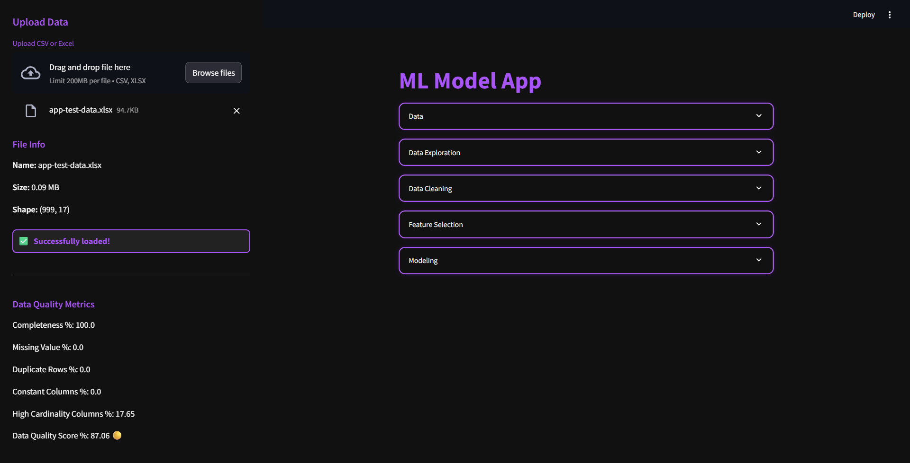

# ML Model App v1.1

A Streamlit-based interactive web application for end-to-end machine learning model development, feature selection, and evaluation.


---

## What's New in v1.1

1. **Data Overview Section:** Instantly preview your dataset, see descriptive statistics, and get a summary of data quality.
2. **Customer-Controlled Balancing:** Users can balance the dataset (oversample/undersample) for target class imbalance directly in the app.
3. **Correlation Visualization:** Interactive correlation heatmap for numeric features.
4. **Custom Null Filling:** Choose how to fill missing values for numeric and categorical columns (mean, median, mode, unknown, drop rows, etc).
5. **Outlier Detection Methods:** Select from multiple outlier detection techniques (IQR, Z-score, Isolation Forest, DBSCAN) and handle outliers interactively.
6. **Custom Train/Test Split:** Set your own train/test split ratio with a slider before feature selection and modeling.
7. **UI Improvements:** Enhanced interface with purple-themed styling, improved warnings, and interactive expanders for each workflow step.
---

## Requirements


Install dependencies:

```sh
pip install -r requirements.txt
```

Or use the provided devcontainer for VS Code remote development. The container will automatically install all dependencies and forward port 8501 for Streamlit.

---

## Usage

1. **Start the App:**
    ```sh
    streamlit run app.py
    ```
2. **Upload Data:** Use the sidebar to upload your CSV or Excel file.
3. **Explore, Clean, and Select Features:** Use the expanders to analyze, clean, and select features. Use the sliders and "Select Features" button for feature selection.
4. **Modeling:** Review ROC curves, power loss, and performance metrics for all models. Adjust train/test split as needed.

---

## File Structure

- `app.py` – Main Streamlit application.
- `app-test-data.xlsx` – Example data file (optional).
- `outcome/` – Folder containing preview results and example outputs of the app based on the test data.

---

## Notes

The app expects a dataset with at least one target column for classification.
Feature selection and modeling are automated but allow user adjustments.
All visualizations are interactive and update with user selections.